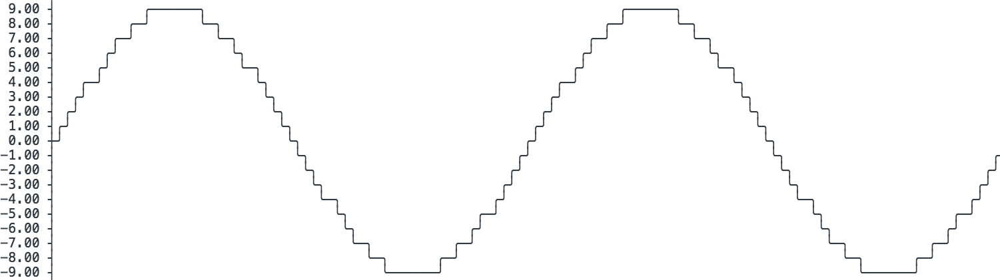

# WORK IN PROGRESS

# asciichart
<a href="https://opensource.org/licenses/MIT"></a>

ASCII line charts in terminal ╭┈╯ for Haskell (adaption from kroitor/asciichart)
Console ASCII line charts in pure Haskell. This code is absolutely free for any usage (MIT Licencse).



## Usage
```bash
cabal install asciichart # will be on hackage soon (no available yet)
```

```haskell
import Data.Text.Chart (plot)

main :: IO()
main = plot [1..20]
```

## References

Full credits to kroitor https://github.com/kroitor/asciichart the inventor of asciichart for the terminal.  
This is only a simple adaptation for the Haskell community.
